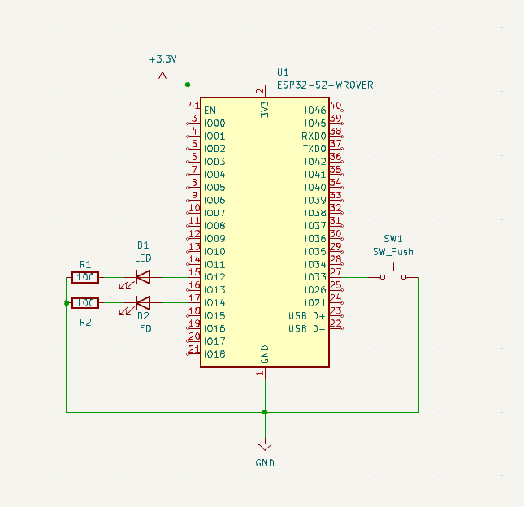

## FLX State Machine

This repository is part of a project for FLX Solutions. The repository contains a main.cpp file which when flashed to an ESP32 module creates a simple state machine that cycles through the following states of two LEDs:

- BOTH LEDS OFF
- LED1 ON / LED2 OFF
- LED1 OFF / LED2 ON
- BOTH LEDs ON

PIN Mappings

<ul>
LED_1 = 12
LED_2 = 14
Button = 33
</ul>

The basic schematic looks like this: 

